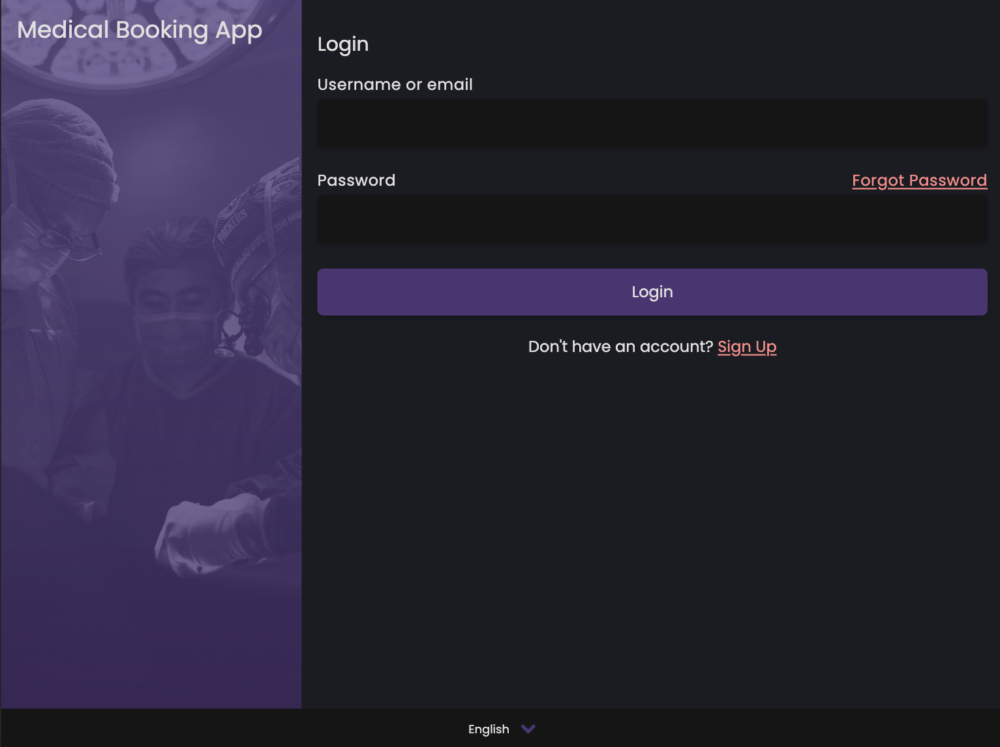

  
   
  <h1>Medical Booking App</h1>

<h4 align="center">A doctor appointment web application made with <a href="https://nextjs.org/" target="_blank">Next.js</a>, <a href="https://graphql.org/" target="_blank">GraphQL</a>, <a href="https://www.prisma.io/" target="_blank">Prisma</a> and <a href="https://tailwindcss.com/" target="_blank">TailwindCSS</a>.</h4>

  

  <a href="#credits">Credits</a> •
  <a href="#license">License</a>

## Credits

- Background images: [Unsplash: Beautiful Free Images & Pictures](https://unsplash.com/)
- useForm hook: [fgerschau/react-custom-form-validation-example](https://github.com/fgerschau/react-custom-form-validation-example)
- Multi-step form: [codeempirev/multi-part-form-react-nextjs](https://github.com/codeempirev/multi-part-form-react-nextjs)

(<a href="#readme-top">back to top</a>)

## License

MIT

---

> GitHub [@chelny](https://github.com/chelny) &nbsp;&middot;&nbsp;
> LinkedIn [Chelny](https://linkedin.com/in/chelny)

(<a href="#readme-top">back to top</a>)

